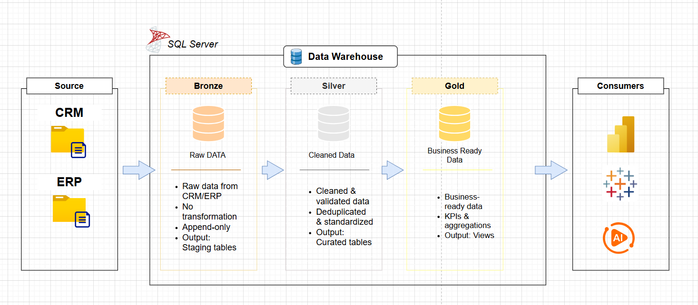
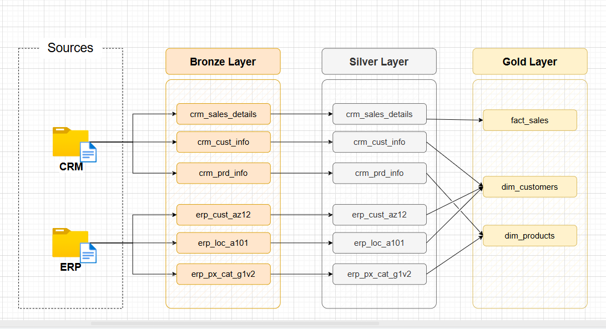
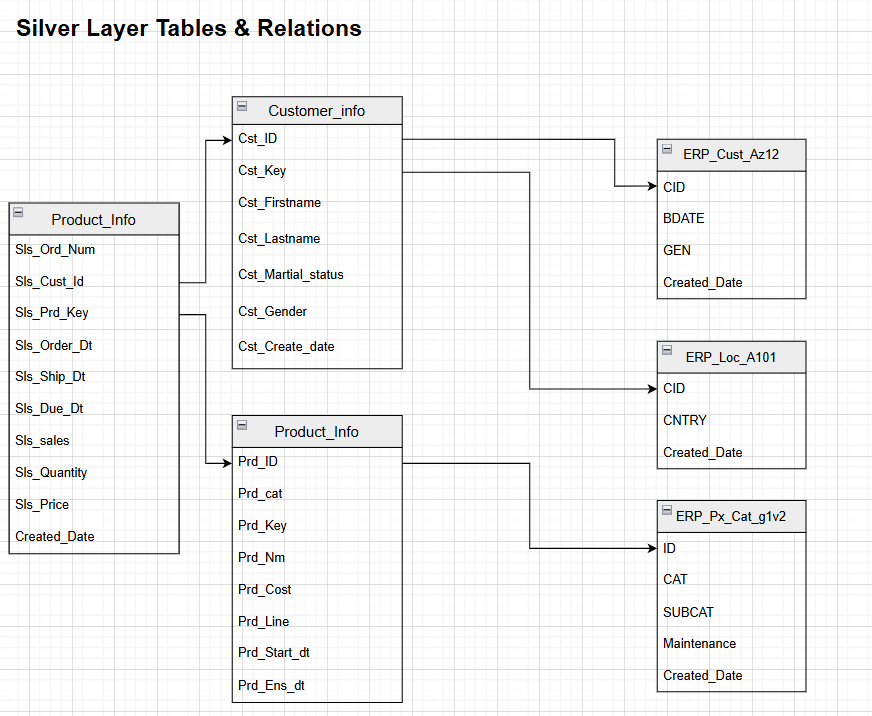
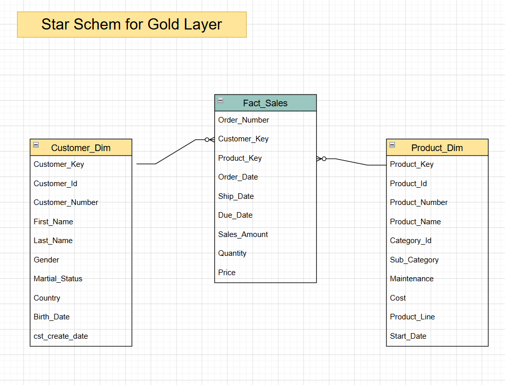

# 🏛️ Medallion Architecture – Data Warehouse Project

A modern **Data Warehouse** built on the **Medallion Architecture** (Bronze → Silver → Gold), designed to transform raw operational data from CRM and ERP source systems into clean, business-ready analytical models.

---

## 📐 Architecture Overview

The pipeline follows a three-layer medallion pattern housed inside a central Data Warehouse, with source data ingested from CRM and ERP systems and consumed by Power BI dashboards and ML/AI models.



| Layer | Color | Purpose |
|-------|-------|---------|
| **Bronze** | 🟤 | Raw ingestion — data is landed as-is from source systems |
| **Silver** | ⚪ | Cleansed & enriched — deduplication, type casting, business rules |
| **Gold** | 🟡 | Business-ready — star schema optimized for analytics & reporting |

---

## 🔄 Data Flow & Lineage

The diagram below traces every table from its source system through each transformation layer to final consumers.



### Source Tables

**CRM System**
- `crm_cust_info` — Customer master data
- `crm_prd_info` — Product catalogue
- `crm_sales_details` — Sales transactions

**ERP System**
- `erp_cust_az12` — ERP customer records
- `erp_loc_a101` — Location / geography data
- `erp_px_cat_g1v2` — Product category hierarchy

---

## 🪙 Bronze Layer — Raw Ingestion

The Bronze layer is a faithful copy of the source data. No transformations are applied — the goal is a reliable, auditable record of every ingested dataset.

**Design principles:**
- No schema changes; source column names preserved
- All records retained (no filtering)
- Load timestamps added for audit trail
- Partitioned by ingestion date

---

## 🥈 Silver Layer — Cleaned & Enriched

The Silver layer applies quality rules and business logic to produce a consistent, joined dataset ready for analytical use.



### Tables & Schema

#### `Customer_info`
| Column | Description |
|--------|-------------|
| `Cst_ID` 🔑 | Surrogate primary key |
| `Cst_Key` | Natural business key |
| `Cst_Firstname` | Customer first name (standardized) |
| `Cst_Lastname` | Customer last name (standardized) |
| `Cst_Martial_status` | Marital status (cleaned/mapped) |
| `Cst_Gender` | Gender (normalized) |
| `Cst_Create_date` | Account creation date |

#### `Product_Info`
| Column | Description |
|--------|-------------|
| `Prd_ID` 🔑 | Surrogate primary key |
| `Prd_Key` | Product business key |
| `Prd_Nm` | Product name |
| `Prd_cat` | Product category |
| `Prd_Cost` | Unit cost |
| `Prd_Line` | Product line |
| `Prd_Start_dt` | Product launch date |
| `Prd_End_dt` | Product end date |

#### `Sales_Details`
| Column | Description |
|--------|-------------|
| `Sls_Ord_Num` 🔑 | Order number (PK) |
| `Sls_Cust_Id` 🔗 | Foreign key → Customer_info |
| `Sls_Prd_Key` 🔗 | Foreign key → Product_Info |
| `Sls_Order_Dt` | Order date |
| `Sls_Ship_Dt` | Ship date |
| `Sls_Due_Dt` | Due date |
| `Sls_sales` | Sales amount |
| `Sls_Quantity` | Quantity sold |
| `Sls_Price` | Unit price |
| `Created_Date` | Record creation timestamp |

**Transformation rules applied in Silver:**
- Null handling and default value assignment
- Date format standardization
- Gender and marital status value normalization
- Duplicate detection and deduplication
- Cross-source customer & product key resolution

---

## 🥇 Gold Layer — Star Schema

The Gold layer is a dimensional model optimized for BI tools and analytical queries. It follows a classic **star schema** with one fact table and two dimension tables.



### ⭐ Star Schema

#### `Fact_Sales` (Fact Table)
| Column | Type | Description |
|--------|------|-------------|
| `Order_Number` 🔑 | PK | Unique order identifier |
| `Customer_Key` 🔗 | FK | Links to Customer_Dim |
| `Product_Key` 🔗 | FK | Links to Product_Dim |
| `Order_Date` | Date | Date order was placed |
| `Ship_Date` | Date | Date order was shipped |
| `Due_Date` | Date | Expected delivery date |
| `Sales_Amount` | Decimal | Total sales value |
| `Quantity` | Integer | Number of units |
| `Price` | Decimal | Unit selling price |
| `Order_Line_Number` | Integer | Line item within an order |

#### `Customer_Dim` (Dimension Table)
| Column | Description |
|--------|-------------|
| `Customer_Key` 🔑 | Surrogate key (SCD) |
| `Customer_Id` | Source system ID |
| `Customer_Number` | Business customer number |
| `First_Name` | First name |
| `Last_Name` | Last name |
| `Gender` | Gender |
| `Marital_Status` | Marital status |
| `Country` | Country of residence |
| `Birth_Date` | Date of birth |
| `cst_create_date` | CRM account creation date |

#### `Product_Dim` (Dimension Table)
| Column | Description |
|--------|-------------|
| `Product_Key` 🔑 | Surrogate key |
| `Product_Id` | Source system ID |
| `Product_Number` | Business product number |
| `Product_Name` | Full product name |
| `Category_Id` | Category identifier |
| `Sub_Category` | Sub-category label |
| `Maintenance` | Maintenance classification |
| `Cost` | Standard cost |
| `Product_Line` | Product line |
| `Start_Date` | Product launch date |

---

## 📊 Consumers

| Consumer | Type | Description |
|----------|------|-------------|
| **Power BI** | Dashboards & Reports | Connected directly to the Gold layer for executive and operational reporting |
| **ML / AI Models** | Analytical | Feature engineering and model training using curated Gold datasets |

---

## 🗂️ Repository Structure

```
📦 dwh-medallion
 ┣ 📂 bronze/
 ┃ ┣ 📄 crm_cust_info.sql
 ┃ ┣ 📄 crm_prd_info.sql
 ┃ ┣ 📄 crm_sales_details.sql
 ┃ ┣ 📄 erp_cust_az12.sql
 ┃ ┣ 📄 erp_loc_a101.sql
 ┃ ┗ 📄 erp_px_cat_g1v2.sql
 ┣ 📂 silver/
 ┃ ┣ 📄 customer_info.sql
 ┃ ┣ 📄 product_info.sql
 ┃ ┗ 📄 sales_details.sql
 ┣ 📂 gold/
 ┃ ┣ 📄 customer_dim.sql
 ┃ ┣ 📄 product_dim.sql
 ┃ ┗ 📄 fact_sales.sql
 ┣ 📂 docs/
 ┃ ┣ 📂 images/
 ┃ ┃ ┣ 🖼️ Data_Architecture.png
 ┃ ┃ ┣ 🖼️ data_flow.png
 ┃ ┃ ┣ 🖼️ Silver_Layer_ERD.png
 ┃ ┃ ┗ 🖼️ Gold_Data_Model.png
 ┃ ┣ 📄 Data_Architecture.drawio
 ┃ ┣ 📄 data_flow.drawio
 ┃ ┣ 📄 Silver_Layer_ERD.drawio
 ┃ ┗ 📄 Gold_Data_Model.drawio
 ┗ 📄 README.md
```

---

## 🚀 Getting Started

### Prerequisites
- SQL-compatible data warehouse (e.g., Azure Synapse, Snowflake, Databricks, PostgreSQL)
- Access to CRM and ERP source systems
- BI tool (Power BI recommended)

### Loading the Layers

```sql
-- 1. Ingest Bronze (raw copy from source)
EXEC bronze.load_crm_cust_info;
EXEC bronze.load_crm_prd_info;
EXEC bronze.load_crm_sales_details;
EXEC bronze.load_erp_cust_az12;
EXEC bronze.load_erp_loc_a101;
EXEC bronze.load_erp_px_cat_g1v2;

-- 2. Transform Silver (clean & enrich)
EXEC silver.load_customer_info;
EXEC silver.load_product_info;
EXEC silver.load_sales_details;

-- 3. Build Gold (star schema)
EXEC gold.load_customer_dim;
EXEC gold.load_product_dim;
EXEC gold.load_fact_sales;
```

---

## 📎 Diagrams (Source Files)

The original editable diagrams are available as `.drawio` files in `docs/`:

| Diagram | File |
|---------|------|
| Overall Architecture | `Data_Architecture.drawio` |
| Data Flow & Lineage | `data_flow.drawio` |
| Silver Layer ERD | `Silver_Layer_ERD.drawio` |
| Gold Star Schema | `Gold_Data_Model.drawio` |

Open with [draw.io](https://app.diagrams.net/) (free, browser-based).

---

## 📄 License

This project is licensed under the MIT License.
