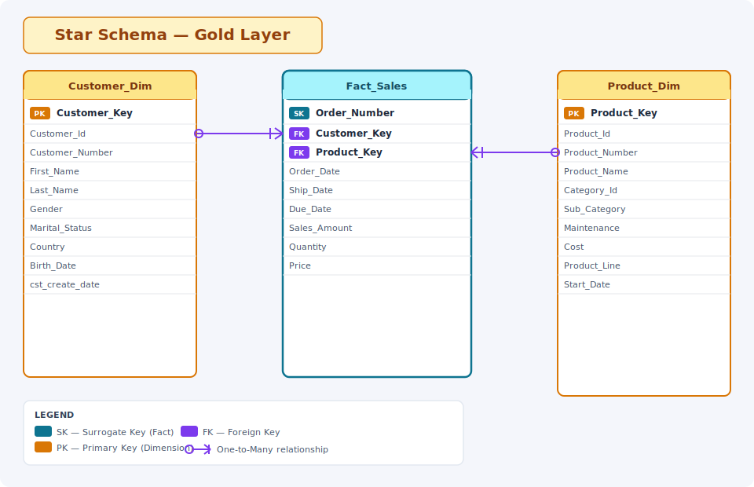

# Data Catalog — Gold Layer Star Schema

> **Layer:** Gold | **Schema Type:** Star Schema | **Purpose:** Analytical / Reporting

---

## Overview

The Gold Layer star schema is designed to support business intelligence and reporting workloads. It consists of one central **fact table** (`Fact_Sales`) surrounded by two **dimension tables** (`Customer_Dim` and `Product_Dim`), enabling efficient slicing and dicing of sales data by customer and product attributes.

---

## Star Schema Diagram



---

## Tables

### 1. Fact_Sales *(Fact Table)*

Central table capturing transactional sales events. Each row represents a single sales order line.

| Column | Data Type | Constraint | Description |
|---|---|---|---|
| Order_Number | VARCHAR | **Surrogate Key** | System-generated unique identifier for each sales order. *Example: `ORD-00019281`* |
| Customer_Key | INT | Foreign Key → Customer_Dim | Reference to the customer who placed the order. *Example: `1042`* |
| Product_Key | INT | Foreign Key → Product_Dim | Reference to the product sold. *Example: `305`* |
| Order_Date | DATE | NOT NULL | Date the order was placed. *Example: `2024-03-15`* |
| Ship_Date | DATE | NULLABLE | Date the order was physically shipped. *Example: `2024-03-17`* |
| Due_Date | DATE | NULLABLE | Expected delivery due date. *Example: `2024-03-22`* |
| Sales_Amount | DECIMAL(18,2) | NOT NULL | Total monetary value of the sale (Price × Quantity). *Example: `1499.98`* |
| Quantity | INT | NOT NULL | Number of units sold in this order line. *Example: `2`* |
| Price | DECIMAL(18,2) | NOT NULL | Unit price at the time of sale. *Example: `749.99`* |

**Grain:** One row per order line item.

**Relationships:**
- `Customer_Key` → `Customer_Dim.Customer_Key` (Many-to-One)
- `Product_Key` → `Product_Dim.Product_Key` (Many-to-One)

---

### 2. Customer_Dim *(Dimension Table)*

Describes the customers who placed orders. Supports demographic and geographic analysis.

| Column | Data Type | Constraint | Description |
|---|---|---|---|
| Customer_Key | INT | **Primary Key** | Surrogate key for the customer dimension. *Example: `1042`* |
| Customer_Id | VARCHAR | NOT NULL | Natural / source system customer identifier. *Example: `CST-7821`* |
| Customer_Number | VARCHAR | NULLABLE | Business-assigned customer number. *Example: `AW00011000`* |
| First_Name | VARCHAR | NOT NULL | Customer's first name. *Example: `Sara`* |
| Last_Name | VARCHAR | NOT NULL | Customer's last name. *Example: `Mitchell`* |
| Gender | VARCHAR | NULLABLE | Customer's gender. *Example: `Female`* |
| Marital_Status | VARCHAR | NULLABLE | Customer's marital status. *Example: `Married`  / `Single` * |
| Country | VARCHAR | NULLABLE | Country of residence. *Example: `United States`* |
| Birth_Date | DATE | NULLABLE | Customer's date of birth. *Example: `1985-07-23`* |
| cst_create_date | DATE | NOT NULL | Date the customer record was created in the source system. *Example: `2020-01-10`* |

**Primary Key:** `Customer_Key`

**Common Use Cases:**
- Sales segmentation by gender, marital status, or country
- Customer age-band analysis using `Birth_Date`
- Cohort analysis using `cst_create_date`

---

### 3. Product_Dim *(Dimension Table)*

Describes the products sold. Supports category, line, and cost-based analysis.

| Column | Data Type | Constraint | Description |
|---|---|---|---|
| Product_Key | INT | **Primary Key** | Surrogate key for the product dimension. *Example: `305`* |
| Product_Id | VARCHAR | NOT NULL | Natural / source system product identifier. *Example: `PRD-00305`* |
| Product_Number | VARCHAR | NULLABLE | Business-assigned product number / SKU. *Example: `BK-R50B-44`* |
| Product_Name | VARCHAR | NOT NULL | Display name of the product. *Example: `Road-650 Black, 44`* |
| Category_Id | VARCHAR | NULLABLE | Identifier for the product category. *Example: `CAT-01`* |
| Sub_Category | VARCHAR | NULLABLE | Sub-category classification of the product. *Example: `Road Bikes`* |
| Maintenance | VARCHAR | NULLABLE | Need Maintenance or not . *Example: `Yes`* |
| Cost | DECIMAL(18,2) | NULLABLE | Standard cost of the product. *Example: `486.75`* |
| Product_Line | VARCHAR | NULLABLE | High-level product line grouping. *Example: `Road`* |
| Start_Date | DATE | NULLABLE | Date the product became available / effective. *Example: `2021-06-01`* |

**Primary Key:** `Product_Key`

**Common Use Cases:**
- Sales performance by category and sub-category
- Margin analysis using `Cost` vs `Fact_Sales.Sales_Amount`
- Product line trend reporting
- Active vs discontinued product filtering via `Marital_Status`

---

## Entity Relationship Summary

```
Customer_Dim ──────< Fact_Sales >────── Product_Dim
(Customer_Key)    (Customer_Key)        (Product_Key)
                  (Product_Key)
```

